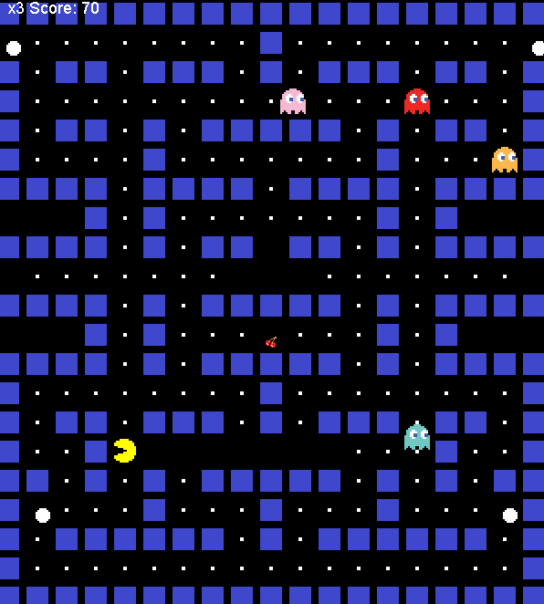

# Pac-Man Java game

Pac-Man game built in **Java** using **Swing**.
This project is a recreation of the classic Pac-Man game where the player guides Pac-Man to eat all the dots without colliding with ghosts.

# Features

- Move Pac-Man using **arrow keys**.
- Pause and Resume the game using **P** and **S** keys.
- **Power-up food**  turns ghosts blue for 5 seconds, which allows Pac-Man to eat ghosts and boost the point.
- After a certain point, **cherry bonus** appears.
- Display shows the **number of lives** and **scores**.
- If Pac-Man collides with ghost,a **life** decreases.
- Press any **key** to restart the game.
- Pac-Man can **teleport** from one side of screen to its opposite side. 

## How to Play 🎮

- Clone the repository.
- Run Pac-Man.java in your preferred Java IDE such as Intellij IDEA, eclipse etc.
- Use Arrow keys to move Pac-Man, eat dots and power-up foods. 
- Avoid ghosts unless they are blue.

## Technologies 
- Java 8+
- Java Swing(for GUI)
- Timer (game Loop and power-up effects)

## Notes

- This project is for **learning purposes**. You can add new features such as sound and animations, different level of maps, and different level of difficulty.

# Developed by: Sahil Bdr. Devkota
# Github: (https://github.com/SahilDevkota)
